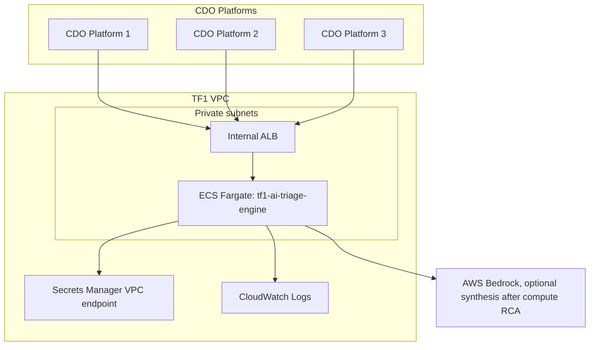

# Deployment Contract - TF1 Triage Hub

Owner: AI team TF1  
Status: Draft for CDO review  
Freeze target: 2026-06-25  
Reviewers: AI Lead, CDO Leads, reviewer panel

## Purpose

Define how the TF1 AI triage engine is packaged, deployed, connected, observed, and rolled back. CDO uses this contract to provision platform infrastructure and call the shared AI endpoint safely.

The AI engine is hosted once for TF1 and consumed by 2-3 CDO platforms through a shared, multi-tenant API. CDO platforms do not deploy separate AI engines unless a formal contract change is approved.

The AI engine is an event-driven triage compute service. CDO/observability components continuously ingest telemetry and run lightweight detection; they call the AI engine only when an alert/anomaly/incident candidate needs triage.

## Runtime Boundary

| Aspect | Decision |
|---|---|
| Service type | Dockerized HTTP API |
| API surface | `GET /healthz`, `POST /v1/triage` |
| Invocation pattern | Event-driven after CDO detection, not continuous telemetry streaming |
| AI pattern | Compute-first RCA, optional Bedrock synthesis |
| Port | `8080` |
| Tenant isolation | `X-Tenant-Id` header must match body `tenant_id` |
| Correlation | `X-Correlation-Id` header must match body `correlation_id` |
| Remediation boundary | AI never executes remediation; it only returns human-reviewed recommendations |

## Compute

| Aspect | Configuration |
|---|---|
| Target | ECS Fargate service behind an internal ALB |
| Region | `us-east-1` for capstone scope |
| Cluster | `tf-1-aiops-cluster` |
| Service name | `tf1-ai-triage-engine` |
| Image source | ECR repo `tf1/ai-triage-engine`, immutable image tag per release |
| CPU per task | 512 CPU units for skeleton, 1024 CPU units if LLM calls are enabled |
| Memory per task | 1024 MB for skeleton, 2048 MB if LLM calls are enabled |

## Scaling

| Aspect | Value |
|---|---|
| Replicas | min 2, max 6 |
| Autoscale trigger 1 | Target CPU 70% |
| Autoscale trigger 2 | Target request count 100 per task |
| Scale-up cooldown | 60 seconds |
| Scale-down cooldown | 300 seconds |
| Load test input | CDO provides target alert burst volume before freeze |

## Configuration And Secrets

| Name | Type | Source | Notes |
|---|---|---|---|
| `APP_ENV` | env var | ECS task definition | `sandbox`, `staging`, or `prod` |
| `LOG_LEVEL` | env var | ECS task definition | Default `INFO` |
| `AI_MODE` | env var | ECS task definition | `rules` for skeleton; `hybrid` when optional Bedrock synthesis is enabled |
| `BEDROCK_MODEL_ID` | env var | ECS task definition | Required only when `AI_MODE=hybrid` |
| `AWS_REGION` | env var | ECS task definition | `us-east-1` |
| `SERVICE_AUTH_TOKEN` | secret | AWS Secrets Manager `tf1/ai-engine/service-auth-token` | Capstone fallback if IAM/JWT is not ready |

No long-lived AWS access keys are stored in the service. Production AWS access uses task roles and scoped IAM policies.

## Networking

| Aspect | Configuration |
|---|---|
| Subnet type | Private subnets |
| Load balancer | Internal ALB only |
| Security group | `tf1-ai-engine-sg` |
| Ingress | Allow only CDO platform security groups on port `8080` or ALB listener port |
| Egress | AWS service endpoints required for CloudWatch, Secrets Manager, and Bedrock if enabled |
| DNS | Private hosted zone record such as `https://ai-engine.tf1.internal` |

## Per-CDO Platform Pointer

| CDO platform | Endpoint URL | Auth draft |
|---|---|---|
| CDO-1 | `https://ai-engine.tf1.internal` | IAM SigV4 preferred; bearer token fallback |
| CDO-2 | Same shared endpoint | IAM SigV4 preferred; bearer token fallback |
| CDO-3 | Same shared endpoint if present | IAM SigV4 preferred; bearer token fallback |

## Health Check

| Field | Value |
|---|---|
| Path | `/healthz` |
| Expected response | `200` with `{"status":"ok"}` |
| Interval | 30 seconds |
| Healthy threshold | 2 consecutive 200 responses |
| Unhealthy threshold | 3 consecutive non-200 responses |

## Rollout Strategy

Use canary rollout once CDO has a working endpoint integration.

| Step | Traffic | Interval |
|---|---:|---|
| 1 | 10% | 5 minutes |
| 2 | 50% | 5 minutes |
| 3 | 100% | Until next release |

Abort and roll back if any of these occur during canary:

- 5xx error rate > 1%.
- P99 latency > 2 seconds for 5 consecutive minutes.
- Tenant mismatch or schema validation failures caused by the new release.
- Missing `audit_id` in any successful triage response.

## Rollback

| Aspect | Value |
|---|---|
| Primary method | Revert ECS service to previous immutable image tag |
| Secondary method | Roll back deployment pipeline release |
| Target RTO | < 5 minutes for capstone |
| Data migration | None for skeleton; future persistent audit schema changes need ADR before freeze |

## Observability

| Aspect | Configuration |
|---|---|
| Logs | Structured JSON logs to CloudWatch Logs, 14-day capstone retention |
| Metrics | Request count, 2xx/4xx/5xx, latency p50/p95/p99, validation failures |
| Traces | Accept and propagate `X-Correlation-Id`; OpenTelemetry optional for CDO platform |
| Audit | Every successful triage response includes `audit_id`; persistent audit store is design target |

## Failure Modes And Response

| Failure | Detection | Response |
|---|---|---|
| Task crash | ECS health check | Auto-restart task |
| AI unavailable | ALB/ECS 5xx or 503 | CDO queues retry or creates fallback ticket |
| Bedrock throttling | App metric after optional LLM synthesis is enabled | Fall back to compute-only response |
| Tenant mismatch | API validation | Return `400`; CDO must fix request |
| Missing context | AI validation | Return successful triage response with `INSUFFICIENT_CONTEXT` |

## Open Questions

- [ ] Final auth mechanism for demo: IAM SigV4, service-to-service JWT, or scoped bearer token.
- [ ] CDO target alert burst volume for load test.
- [ ] Whether persistent audit storage is implemented by AI service or CDO platform for capstone.
