# Solution Design - TF1 Triage Hub

Owner: AI team TF1  
Status: Draft for CDO review  
Last updated: 2026-06-22

## 1. High-Level Architecture

TF1 uses an event-driven triage design. Telemetry is ingested continuously by the CDO/observability platform, but the AI triage engine is invoked only after an alert, anomaly, or incident candidate exists.

```mermaid
graph LR
    A[Services emit metrics logs traces deploy events] --> B[CDO observability ingestion]
    B --> C[Lightweight detection: threshold anomaly SLO burn rate]
    C -->|Alert or anomaly candidate| D[Context aggregation window]
    D -->|POST /v1/triage| E[TF1 AI triage engine]
    E --> F[Compute-first RCA and confidence gate]
    F -->|Optional grounded synthesis| G[Bedrock LLM]
    F --> H[Jira payload Slack payload audit id]
    G --> H
```

The AI triage engine is not a continuous metrics reader and is not a direct Bedrock wrapper. It is a Dockerized compute service that performs schema validation, feature extraction, deterministic anomaly/RCA scoring, confidence gating, safety checks, and optional LLM synthesis.

## 2. Component Breakdown

| Component | Owner | Responsibility | Tech choice | Reason |
|---|---|---|---|---|
| Telemetry ingestion | CDO | Continuously collect metrics, logs, traces, deploy events, and alert events. | CDO platform choice | Keeps infra credentials and observability integration in the platform boundary. |
| Lightweight detection | CDO | Detect threshold breaches, anomaly candidates, SLO burn rate, and alert grouping. | CDO platform choice | Runs continuously and cheaply before expensive triage. |
| Context aggregation | CDO | Build bounded incident context windows for `/v1/triage`. | CDO service or workflow | Prevents AI from needing direct access to every telemetry store. |
| AI triage engine | AI | Validate request, extract features, run RCA scoring, confidence gate, and produce response payloads. | Dockerized FastAPI service on ECS/Fargate | Gives AI team full control of diagnosis behavior and API contract. |
| Optional LLM synthesis | AI | Turn grounded RCA evidence into concise Jira/Slack wording and runbook-aware recommendations. | Bedrock via AI engine | LLM is used after compute evidence exists, not as the first decision-maker. |
| Ticket/notification integration | CDO | Create Jira issue and send Slack notification using AI response payloads. | Jira/Slack APIs | Platform owns delivery and operational integration. |
| Audit | Shared design, implementation TBD | Persist traceable AI decisions and link them to ticket/notification artifacts. | DynamoDB/S3/CloudWatch, final owner TBD | Required for confidence behavior and demo evidence. |

## 3. Data Flow

1. Services continuously emit telemetry: metrics, logs, traces, deploy events, and alert-source events.
2. CDO ingestion stores or streams telemetry and runs lightweight detection continuously.
3. When an alert/anomaly/incident candidate is detected, CDO creates a bounded context bundle around the event window.
4. CDO calls `POST /v1/triage` with normalized alert metadata, metrics, logs, recent deploys, ownership, and runbook/docs context.
5. The AI engine validates tenant/correlation headers, validates schema, extracts features, and runs compute-first RCA rules/scoring.
6. The AI engine applies confidence gates:
   - high enough signal: `DIAGNOSED`
   - weak or conflicting signal: `INVESTIGATE`
   - missing supporting context: `INSUFFICIENT_CONTEXT`
7. If enabled, the AI engine calls Bedrock only to synthesize grounded human-readable diagnosis, recommendations, Jira description, and Slack text.
8. CDO uses the response to create Jira/Slack artifacts and persists or links the audit ID.

## 4. Key Design Decisions

### 4.1 Continuous Triage vs Event-Driven Triage

- Option A: Run full AI triage continuously on all telemetry.
  - Pros: could detect subtle patterns earlier.
  - Cons: expensive, noisy, difficult to scale, and overuses LLM/compute for non-incidents.
- Option B: Run lightweight detection continuously, invoke AI triage only on incident candidates.
  - Pros: lower cost, clearer CDO/AI boundary, easier to test and defend.
  - Cons: depends on CDO detection quality and context aggregation.

Chosen: Option B. TF1 AI triage is event-driven.

### 4.2 LLM-First vs Compute-First RCA

- Option A: Send raw incident context directly to Bedrock and ask for diagnosis.
  - Pros: faster to prototype.
  - Cons: weaker evidence control, harder confidence calibration, higher hallucination risk.
- Option B: Run deterministic RCA/scoring first, then optionally call Bedrock for synthesis.
  - Pros: more explainable, safer, cheaper, and easier to evaluate.
  - Cons: requires more explicit scenario logic.

Chosen: Option B. Bedrock is optional synthesis after grounded compute evidence.

### 4.3 AI Pulls Telemetry vs CDO Aggregates Context

- Option A: AI pulls directly from logs, metrics, deploy stores, Jira, and Slack.
  - Pros: AI owns full context retrieval.
  - Cons: AI would need broad credentials, network routes, and connector maintenance.
- Option B: CDO aggregates the context bundle and calls AI.
  - Pros: clearer ownership, easier security review, faster capstone delivery.
  - Cons: CDO must provide enough context quality.

Chosen: Option B. CDO owns continuous ingestion, detection, and context aggregation.

## 5. Risk And Mitigation

| Risk | Likelihood | Impact | Mitigation |
|---|---|---|---|
| CDO context bundle misses important telemetry | Medium | High | Return `INSUFFICIENT_CONTEXT`, document missing fields, and add datapack mapping checks. |
| Detection layer sends noisy incident candidates | Medium | Medium | Confidence gate returns `INVESTIGATE` for weak/conflicting signals. |
| LLM hallucinates root cause | Medium | High | Compute-first evidence, schema validation, grounding checks, and no direct auto-remediation. |
| Bedrock throttling or outage | Medium | Medium | Keep rule-based path available; fallback to deterministic response without LLM. |
| Tenant data leak | Low | High | Enforce header/body tenant match and avoid cross-request context persistence. |
| CDO assumes AI reads telemetry continuously | Medium | Medium | Contracts state `/v1/triage` is event-driven and context-bundle based. |

## 6. Open Design Questions

- [ ] Final auth mechanism for CDO-to-AI calls.
- [ ] Persistent audit store owner: AI service or CDO platform.
- [ ] Exact detector ownership details per CDO platform implementation.
- [ ] Mentor datapack schema and whether it includes runbooks/docs.

## Related Documents

- [`03_ai_engine_spec.md`](03_ai_engine_spec.md) - AI engine architecture detail, governance, and security.
- [`../contracts/telemetry-contract.md`](../contracts/telemetry-contract.md) - normalized context bundle contract.
- [`../contracts/ai-api-contract.md`](../contracts/ai-api-contract.md) - API consumed by CDO.
- [`../contracts/deployment-contract.md`](../contracts/deployment-contract.md) - deployment topology.
- [`05_adrs.md`](05_adrs.md) - architecture decision records.
