# Solution Design - TF1 Triage Hub

Owner: AI team TF1
Status: Final candidate for W11 CDO sign-off
Last updated: 2026-06-24

## 1. High-Level Architecture

TF1 uses an event-driven triage design. Production-grade ownership is split between platform observability and AIOps reasoning. Platform/DevOps makes telemetry observable, queryable, secure, and bounded. The AIOps app consumes bounded telemetry windows, then performs normalization, aggregation, baseline comparison, anomaly detection, context packaging, RCA, and optional LLM synthesis.

```mermaid
graph LR
    A[Services or simulator emit metrics logs traces deploy events] --> B[Platform observability stack: OTel Prometheus Loki Jaeger Grafana CloudWatch]
    B -->|bounded query/export by tenant service env window| C[AIOps ingestion and context service]
    C --> D[Normalize window baseline trend]
    D --> E[Lightweight anomaly detection]
    E -->|Incident candidate| F[Context package]
    F -->|POST /v1/triage| G[Compute-first RCA and confidence gate]
    G -->|Optional grounded synthesis| H[Bedrock LLM]
    G --> I[Report JSON audit artifact]
    I --> J[Slack summary Jira payload React report UI]
    H --> I
```

The triage engine is not a direct Bedrock wrapper. It is a Dockerized compute service that receives bounded context, performs schema validation, feature extraction, deterministic RCA scoring, confidence gating, safety checks, and optional LLM synthesis.

## 2. Component Breakdown

| Component | Owner | Responsibility | Tech choice | Reason |
|---|---|---|---|---|
| Observability stack | Platform/DevOps | Collect, store, retain, secure, and expose metrics/logs/traces/deploy events. | OpenTelemetry, Prometheus/Grafana, Loki, CloudWatch, or capstone simulator | Platform ensures data is observable and accessible safely. |
| AIOps ingestion/context | AIOps app | Query bounded telemetry windows, normalize schema, aggregate windows, compute baseline/trend. | Python/FastAPI worker or service | This is product logic, not platform plumbing. |
| Lightweight detection | AIOps app | Detect threshold breaches, anomaly candidates, SLO burn rate, and alert grouping. | Rules/statistics initially; ML/anomaly model later if needed | Runs continuously and cheaply before expensive RCA or LLM synthesis. |
| Context aggregation | AIOps app | Build bounded incident context windows for triage. | Internal service/workflow | Converts raw telemetry into a normalized incident context bundle. |
| AI triage engine | AIOps app | Validate request, extract features, run RCA scoring, confidence gate, and produce response payloads. | Dockerized FastAPI service on ECS/Fargate | Gives the team full control of diagnosis behavior and API contract. |
| Optional LLM synthesis | AIOps app | Turn grounded RCA evidence into concise Jira/Slack wording and runbook-aware recommendations. | Bedrock via AI engine | LLM is used after compute evidence exists, not as the first decision-maker. |
| Ticket/notification integration | AIOps app, with platform credentials/config | Create Jira issue and send Slack notification using AI response payloads. | Jira/Slack APIs or mocks | Required for E2E demo flow. |
| Audit/report store | AIOps app | Persist traceable AI decisions and link them to ticket/notification artifacts. | JSON files for local demo; DynamoDB/S3/CloudWatch later | Required for confidence behavior and demo evidence. |
| Report UI | AIOps app | Render incident list, RCA candidates, evidence, topology, causal hints, Slack/Jira previews, and audit metadata. | React/Vite local demo UI | Keeps Slack concise while preserving a complete investigation surface. |
| Telemetry simulator | AIOps app for demo/eval | Replay sanitized RCAEval-style cases into observability as metrics, logs, and traces. | Python, Prometheus client, Loki push API, OTLP traces | Lets the capstone demonstrate production-like data flow without committing the full RCAEval dataset. |
| Local observability stack | Platform-like demo fixture | Collect and expose metrics/logs/traces for bounded worker queries. | Docker Compose, OpenTelemetry Collector, Prometheus, Loki, Jaeger, Grafana | Keeps DevOps/CDO ownership boundaries visible in local evaluation. |

## 3. Data Flow

1. Services continuously emit telemetry: metrics, logs, traces, deploy events, and alert-source events.
2. Platform observability stack collects/stores telemetry and exposes bounded query/export paths by tenant, service, environment, and time window.
3. AIOps ingestion/context service queries bounded slices, normalizes schema, aggregates windows, and computes baseline/trend.
4. AIOps detector runs threshold/log checks plus 3-sigma, EWMA drift, and Isolation Forest anomaly logic continuously over bounded summaries.
5. When an alert/anomaly/incident candidate is detected, the AIOps app creates a bounded context bundle around the event window.
6. The detector/context layer invokes the triage engine, either through an internal event or `POST /v1/triage`, with normalized alert metadata, metrics, logs, recent deploys, ownership, and runbook/docs context.
7. The AI engine validates tenant/correlation headers, validates schema, extracts features, and runs compute-first RCA rules/scoring with topology-aware candidates, bounded anomaly evidence, experimental lag-correlation causal hints, and deterministic investigator summaries.
8. The AI engine applies confidence gates:
   - high enough signal: `DIAGNOSED`
   - weak or conflicting signal: `INVESTIGATE`
   - missing supporting context: `INSUFFICIENT_CONTEXT`
9. If enabled, the AI engine calls Bedrock only to synthesize grounded human-readable diagnosis, recommendations, Jira description, and Slack text.
10. The AIOps integration layer writes `reports/{incident_id}.json`, uses Slack for a concise notification with report link, and keeps Jira payload generation available for workflow integration.
11. Grafana remains the raw observability dashboard. The React report UI is the AI RCA explanation and audit surface.

For the local demo, `engine-skeleton/app/simulator.py` replays sanitized scenario files into the Compose observability stack, and `engine-skeleton/app/aiops_worker.py` queries Prometheus/Loki/Jaeger before building the `telemetry-contract.md` request. The triage service receives bounded normalized context, enriches the response with optional RCA/report fields, and exposes local report APIs for the React viewer.

For the W11 handoff, the primary scenario datapacks are RCAEval-derived evidence bundles under `engine-skeleton/datapack/external/evidence-bundles/`. These bundles give CDO a concrete artifact to host and expose while preserving the production boundary: CDO owns evidence storage/access, and AIOps owns RCA interpretation. Synthetic scenario fixtures remain useful for smoke tests and dashboard demos, but they are not the primary evaluation source.

## 4. Key Design Decisions

### 4.1 Continuous Triage vs Event-Driven Triage

- Option A: Run full AI triage continuously on all telemetry.
  - Pros: could detect subtle patterns earlier.
  - Cons: expensive, noisy, difficult to scale, and overuses LLM/compute for non-incidents.
- Option B: Run lightweight detection continuously inside the AIOps app, invoke AI triage only on incident candidates.
  - Pros: lower cost, clearer detector/triage boundary, easier to test and defend.
  - Cons: depends on detection quality and context aggregation.

Chosen: Option B. TF1 AIOps continuously detects, then invokes triage event-by-event.

### 4.2 LLM-First vs Compute-First RCA

- Option A: Send raw incident context directly to Bedrock and ask for diagnosis.
  - Pros: faster to prototype.
  - Cons: weaker evidence control, harder confidence calibration, higher hallucination risk.
- Option B: Run deterministic RCA/scoring first, then optionally call Bedrock for synthesis.
  - Pros: more explainable, safer, cheaper, and easier to evaluate.
  - Cons: requires more explicit scenario logic.

Chosen: Option B. Bedrock is optional synthesis after grounded compute evidence.

### 4.3 Triage Pulls Raw Telemetry vs Internal Context Aggregation

- Option A: The triage/RCA function pulls directly from every raw telemetry store at request time.
  - Pros: triage has direct retrieval control.
  - Cons: tighter coupling, higher latency, broader runtime permissions, and harder testing.
- Option B: Platform observability exposes bounded telemetry, then AIOps context logic builds a normalized context bundle before triage.
  - Pros: clearer platform/AIOps separation, cheaper triage calls, easier replay/eval, and safer LLM prompting.
  - Cons: observability data contract must preserve enough evidence for RCA.

Chosen: Option B. Platform owns observability plumbing and bounded access. AIOps owns normalization, detection, context aggregation, and incident-level RCA.

## 5. Risk And Mitigation

| Risk | Likelihood | Impact | Mitigation |
|---|---|---|---|
| Context bundle misses important telemetry | Medium | High | Return `INSUFFICIENT_CONTEXT`, document missing fields, and add datapack mapping checks. |
| Detection layer sends noisy incident candidates | Medium | Medium | Confidence gate returns `INVESTIGATE` for weak/conflicting signals and tune detector thresholds/statistical evidence weights. |
| LLM hallucinates root cause | Medium | High | Compute-first evidence, schema validation, grounding checks, and no direct auto-remediation. |
| Bedrock throttling or outage | Medium | Medium | Keep rule-based path available; fallback to deterministic response without LLM. |
| Tenant data leak | Low | High | Enforce header/body tenant match and avoid cross-request context persistence. |
| Team conflates continuous detection with full continuous LLM triage | Medium | Medium | Document two-stage design: continuous detector, event-driven triage/RCA. |

## 6. W11 Decisions And Deferred Items

| Item | W11 decision |
|---|---|
| Auth | Private network or protected gateway with scoped bearer token fallback for capstone. IAM SigV4 or service-to-service JWT remains production-preferred. |
| Persistent audit store | JSON/report store is accepted for W11 skeleton/demo; object storage or database-backed metadata is the production target. |
| Local demo path | Simulator/evidence bundles -> bounded observability/context -> `/v1/triage` -> report JSON/API -> React report UI. |
| Production telemetry mix | Any CDO-approved Prometheus/Loki/Jaeger/CloudWatch/OpenTelemetry mix is acceptable if it satisfies the supporting `observability-data-contract.md`. |
| Dataset schema | RCAEval metrics are primary. Supplemental logs/traces/deploy/ownership/runbook records are used only where the RCAEval subset lacks those fields. |
| Deferred | Final AWS endpoint URL and live CDO observability backend are recorded after deployment smoke tests pass. |

## Related Documents

- [`03_ai_engine_spec.md`](03_ai_engine_spec.md) - AI engine architecture detail, governance, and security.
- [`../contracts/observability-data-contract.md`](../contracts/observability-data-contract.md) - supporting platform observability/evidence handoff; not one of the 3 signed W11 contracts.
- [`../contracts/telemetry-contract.md`](../contracts/telemetry-contract.md) - normalized context bundle contract.
- [`../contracts/ai-api-contract.md`](../contracts/ai-api-contract.md) - API consumed by the detector/context layer.
- [`../contracts/deployment-contract.md`](../contracts/deployment-contract.md) - deployment topology.
- [`05_adrs.md`](05_adrs.md) - architecture decision records.
